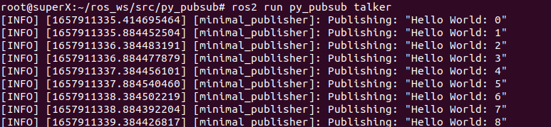
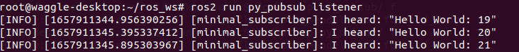

### System Requirements

software requirements: docker, two host machines connected within local network(only Ethernet is supported)

### Set up environment

1. build docker image

```
docker build -t ${tag_name} -f ros2.Dockerfile .
```

2. run docker image and set docker network as host, open a docker bash


```
docker run -it --net=host ${tag_name}
```

3. open a new terminal on your host machine, copy the ros2 package

```
docker cp py_pubsub/ ${conatiner_name}:/root/ros_ws/src
```

4. inside docker bash

```
cd ~/ros_ws && colcon build
source ~/.bashrc
```

repeat the same procedure on host machine 2

### Test Results

inside docker bash

```
ros2 run py_pubsub talker
```



```
ros2 run py_pubsub listenr
```




### Alternative way to run docker containers(no host network)
currently, this one works both on Wifi and Ethernet.

1.run docker image and open port 7414, 7415

```
docker run -it -p 7414:7414/udp -p 7415:7415/udp ros2
```

2.replace the address under <metatrafficUnicastLocatorList> and <defaultUnicastLocatorList> in DEFAULT_FASTRTPS_PROFILES.xml with local IP address and replace the address under <initialPeersList> with remote IP address.

3.on host machine, copy the DEFAULT_FASTRTPS_PROFILES.xml and ros package to docker container

```
docker cp DEFAULT_FASTRTPS_PROFILES.xml ${conatiner_name}:root/ros_ws
docker cp py_pubsub/ ${conatiner_name}:/root/ros_ws/src
```

the other remaining steps are same
