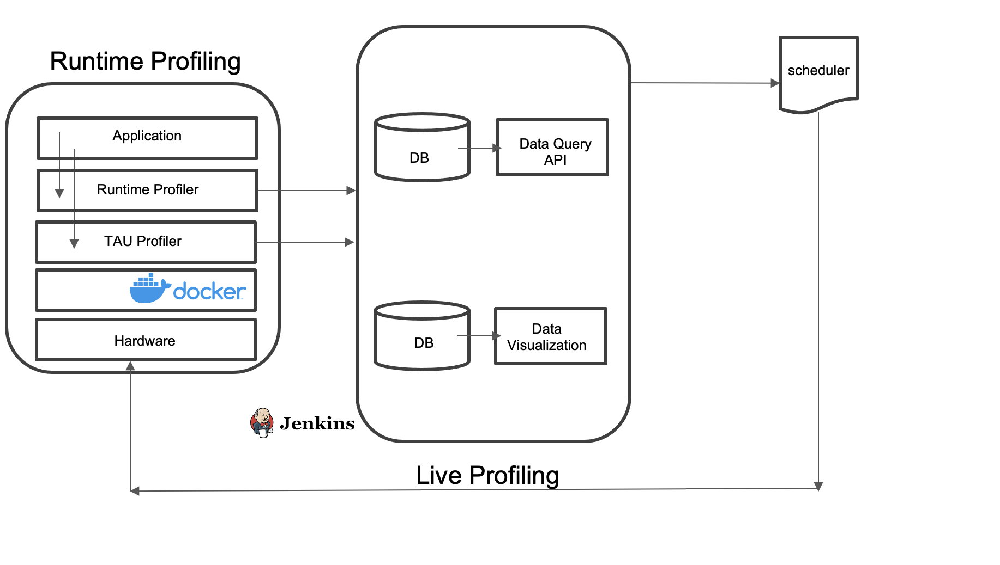

# Runtime code profiling


## Installing and running code

- First step is build the docker image. For the example name application as app-example:latest run the following command in terminal

    ``` cd runtime-application profiler ```

    ``` docker build -t app-example:latest . ```

- Second step is to run. Note that this docker image will only work running on an NVIDIA NX device.

    ``` nvidia-docker run -it -v /var/run/docker.sock:/var/run/docker.sock -v /var/run/jtop.sock:/var/run/jtop.sock -v /home/nvidia/Desktop/metrics:/app/output -e PYWAGGLE_LOG_DIR=/app/output app-example:latest ```

- Third step is to run profiler within the container.

    ``` sh start.sh ```
