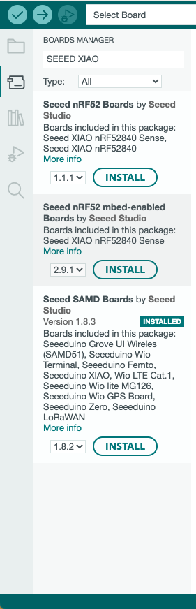
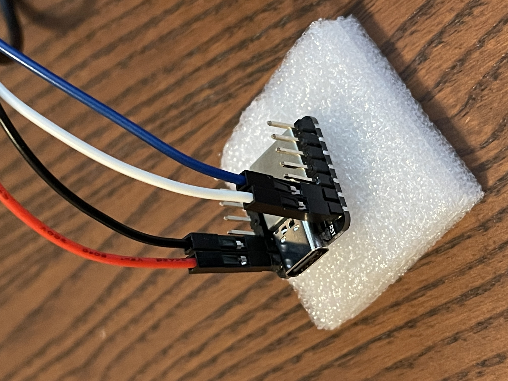
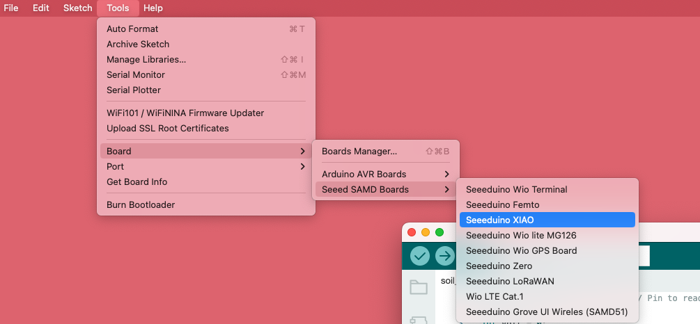
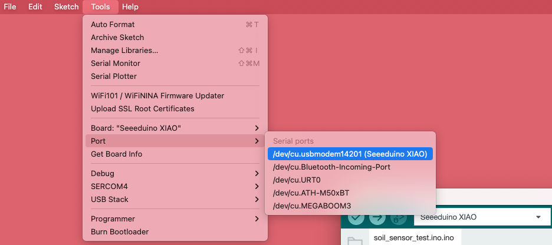
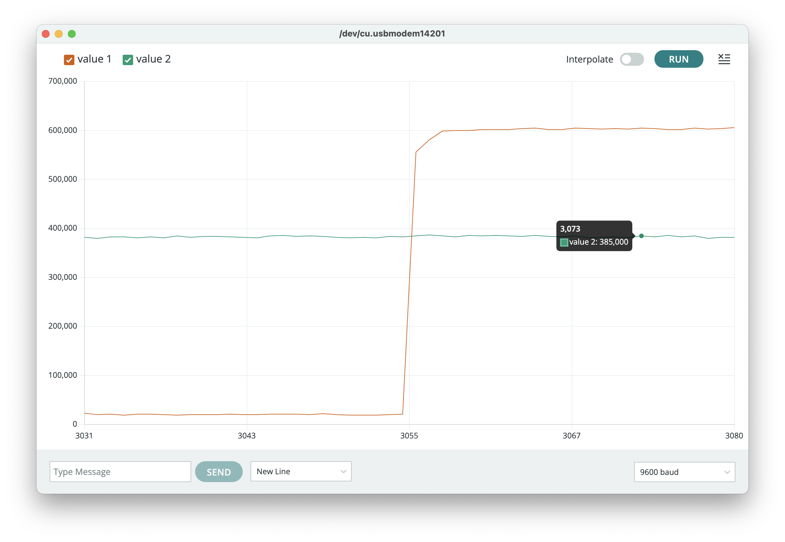
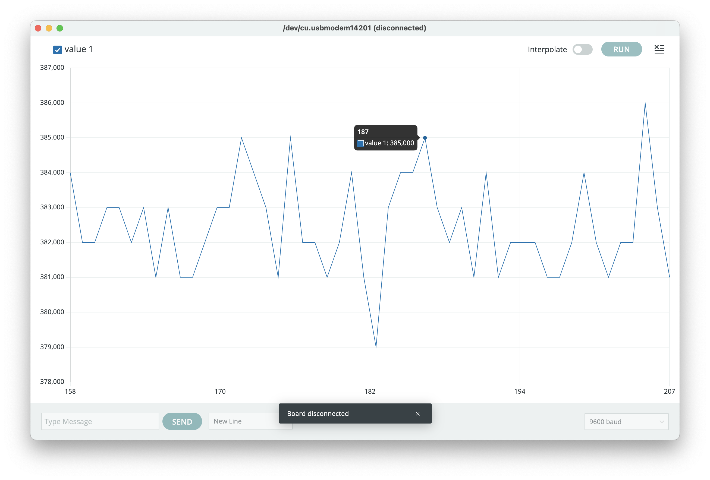
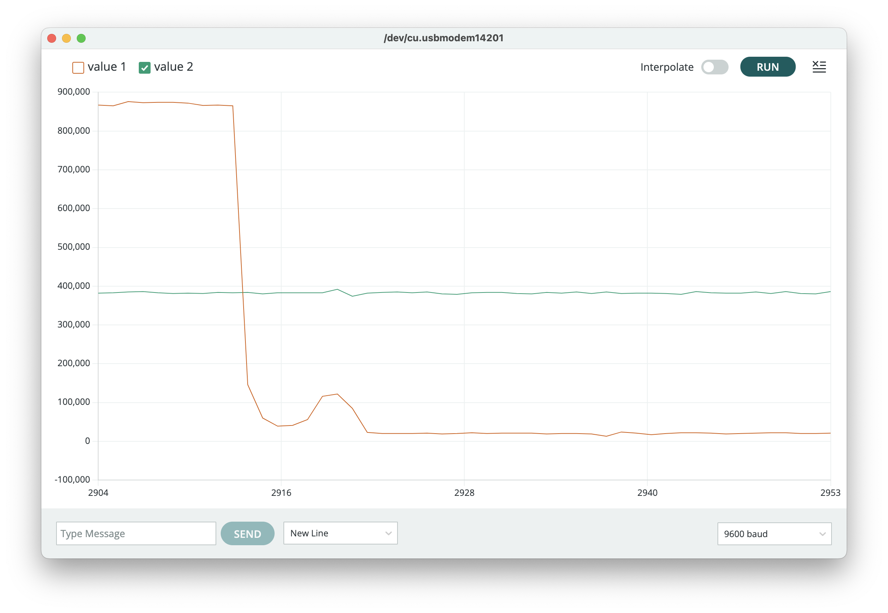

# README for Soil Sensor Instructions

The process below describes the initial stages of setting up the soil moisture and temperature sensor

---

### Hardware Needed
* USB-C to USB-C wire for serial read
* Seeeduino XIAO board running SAMD21 
  * More instructions on the device can be found [here](https://wiki.seeedstudio.com/Seeeduino-XIAO/)
* Modified soil sensor with four jumper wires with female input 

Thank you to Colorado State University for the sensor. 

### Installing Software
1. To connect to the XIAO board, you will need to install the [Arduino IDE](https://support.arduino.cc/hc/en-us/articles/360019833020-Download-and-install-Arduino-IDE)
2. Once you installed the IDE, you need to further install the board's software support
   1. Under Boards Manager, look up "Seeed XIAO" and install "Seeed SAMD Boards by Seeed Studio"
   

### Connecting Board to Sensor
> Note: red wire is for power, black is for ground, white for soil moisture, and blue for soil temperature
1. Grab the soil sensor 
2. Connect the wires from the sensor to the board as shown: 

### Connect Board to Computer
1. Connect the board to your computer with the USB-C wire
   1. You should see a green light glow on the board
2. Go to Tools in Arduino IDE and select "Seeeduino XIAO" for Board and select the correct serial port for the arduino as shown: 

### Testing Soil Sensor
Running the provided code in this directory provided the following serial plots, where green is temperature readings and orange is moisture readings:

**First Graph:**
At 3055 capture, I dipped half of the sensor into room temperature water. We can see a clear change in mV.

**Second Graph:**
At 170 capture, I dipped half of the sensor into refrigerated water. There's no clear indication of temperature change.

**Third Graph:**
I completely submerge the sensor into room temperature water and take it out at capture 2910. 

**For more detailed instructions in capturing data with the soil sensor go to the [read_sensor](./read_sensor/README.md) directory** 