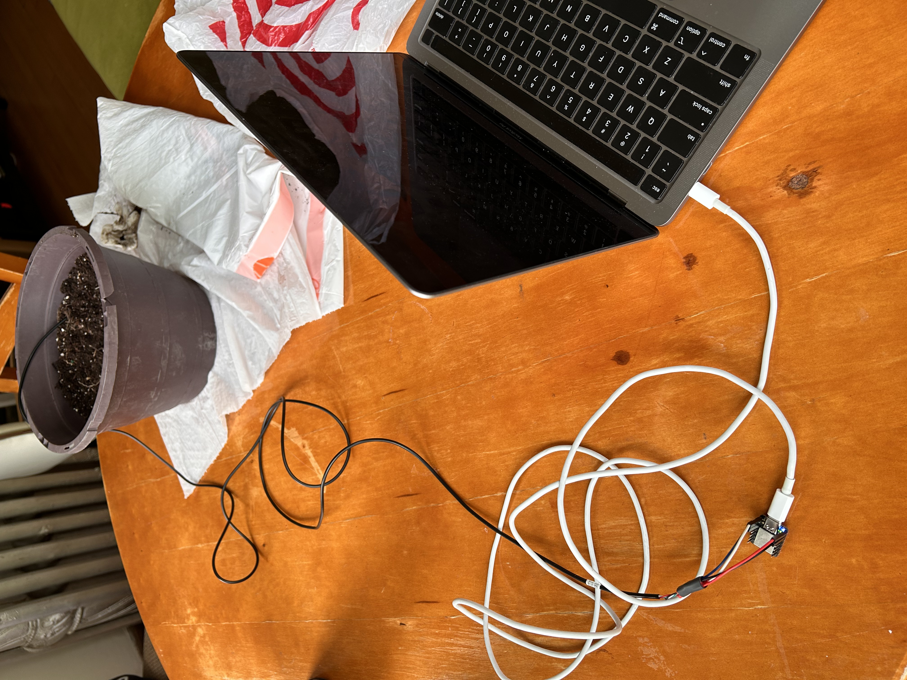
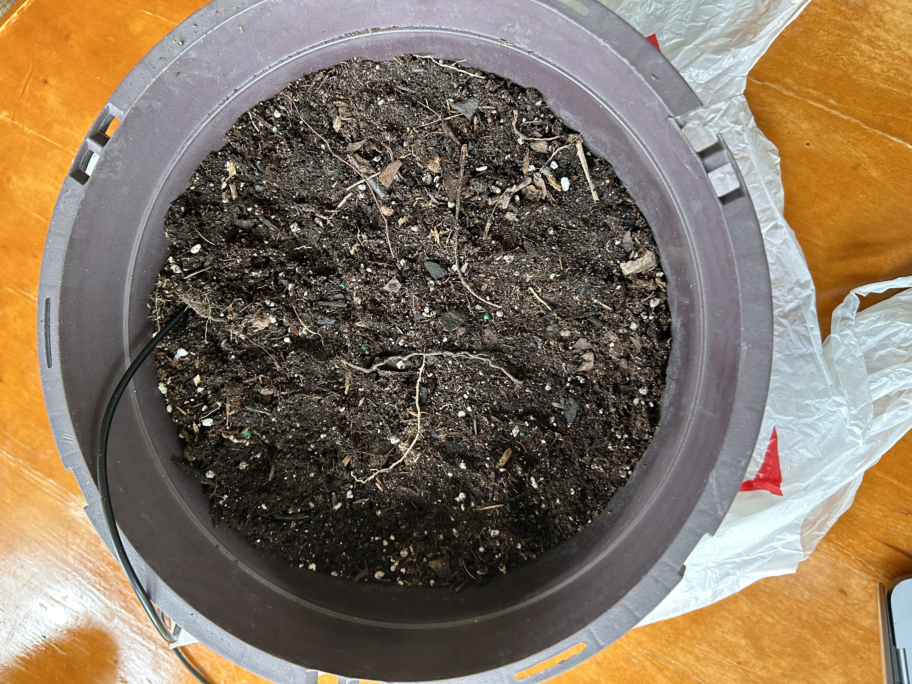

# Capturing Soil Sensor Data

This notebook contains two experiments for using the soil sensor

---

#### Methodology
1. Install Processing from [processing.org](https://processing.org/download)
2. Run "soil_sensor_test.ino" to send instructions to the arduino to collect data
   1. Modify line 19 to change the read interval in milliseconds
3. Run "reading_sensor.pde" on the computer reading serially from the arduino to save the data
   1. Modify line 8 to change output file name

> Note: First column in the data is humidity; Second column is temperature 

Connected System: 

Sensor in Soil:

---

####  First Experiment

Title: E1_5sec_40min
Summary: Submerge sensor in iced water at 5 second interval reads for a total of 40 minutes 

* [0-5] Sensor is just laying on a table
* [5-10] Sensor submerged in iced water
* [10-40] Sensor resting on table after being pat dry

--- 

#### Second Experiment

Title: E2_10sec_3.25hr
Summary: The pot of dirt is 4.5 inches deep and 9.5 inches wide, so sensor buried under 2.25 inches of dirt. Pour iced water over dirt at specified intervals

* [0-15] Bury soil sensor in soil and let rest for 15 minutes
  * Since the pot isn't very big, I buried the sensor horizontally instead of vertically
* [15-45] Add an 1/8 cup of water every 30 minutes by sprinkling it on top 
* [45-1:15] Added again at 45
* [1:15-1:45] Added 1/4 cup of water now
* [1:45-2:15] Added 3/8 cup of water
* [2:15-3:15] Added a full cup of water and wait for 1 hour